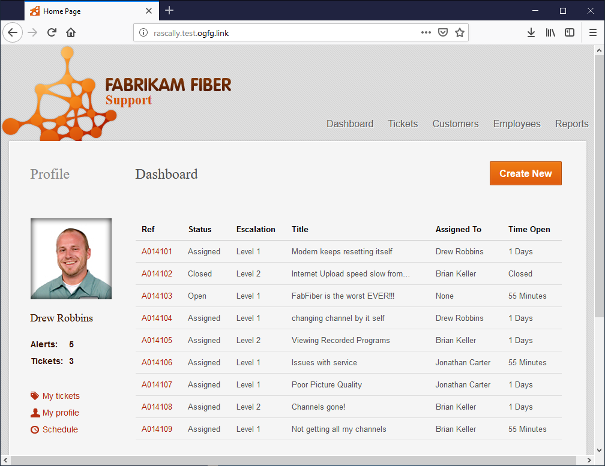

## Preparation

Before you start, be sure that:

- You have a working KUBECONFIG. Try running `kubectl get pod` and make sure there are no errors
- Know what namespaces you have access to. `kubectl config get-contexts` will show your current namespace.


## Get the example deployment files

All the files used to build the demo are on GitHub at [patricklang/fabrikamfiber]((https://github.com/PatrickLang/fabrikamfiber/tree/helm-2019-mssql-linux)). We'll clone that repo, but instead of building everything from scratch we'll just modify and use the Kubernetes deployment YAML there. Since we're not building the Windows container, these steps work great on any platform with a `kubectl` build. Nothing else is needed.

If you're using the Lab VM at Kubecon, first open a PowerShell window with the `>_` icon on the taskbar, then clone the repo

```powershell
cd \repos
git clone https://github.com/PatrickLang/fabrikamfiber.git
```

Change to the `k8s` directory where the deployment files are.

Run `code .` to open them in Visual Studio Code.

There are 5 files that are used:
- db-secret.yaml - shared secret for the database password
- db-mssql-linux.yaml - the database deployment
- db-service.yaml - the database service. this is needed so the website can find it by name
- fabrikamfiber.web-deployment.yaml - the website deployment
- fabrikamfiber.web-ingress.yaml - an internal service and external ingress rule
  - (If you're doing this on your own, you may prefer fabrikamfiber.web-loadbalancer.yaml to use a loadbalancer instead of ingress controller)

Modify `fabrikamfiber.web-ingress.yaml`, and change the first part of `host: rascally.test.ogfg.link` to something unique. Make sure it ends with `.test.ogfg.link` for the Kubecon lab since that's the preconfigured ingress controller.

Here's what the full file will look like:

```yaml
apiVersion: v1
kind: Service
metadata:
  labels:
    app: fabrikamfiber.web
  name: fabrikamfiberweb
spec:
  ports:
  - port: 80
  type: "ClusterIP"
  selector:
    app: fabrikamfiber.web
---
apiVersion: extensions/v1beta1
kind: Ingress
metadata:
  annotations:
    kubernetes.io/ingress.class: nginx
  name: fabrikamfiberweb-ingress
spec:
  rules:
    - host: rascally.test.ogfg.link
      http:
        paths:
          - backend:
              serviceName: fabrikamfiberweb
              servicePort: 80
            path: /
```

After you've set a unique hostname, run `kubectl create` on each of those files:

```powershell
kubectl create -f .\db-secret.yaml
secret/mssql created

kubectl create -f .\db-mssql-linux.yaml
deployment.apps/db created

kubectl create -f .\db-service.yaml
service/db created

kubectl create -f .\fabrikamfiber.web-deployment.yaml
deployment.apps/fabrikamfiber.web created

kubectl -n rascally create -f .\fabrikamfiber.web-ingress.yaml
service/fabrikamfiberweb created
ingress.extensions/fabrikamfiberweb-ingress created
```

Once that's done, check the status and wait for the pod to be `Running`

```powershell
PS C:\repos\fabrikamfiber\k8s> kubectl get all
NAME                                    READY   STATUS              RESTARTS   AGE
pod/db-56d898d6c-9qvnz                  0/1     ContainerCreating   0          30s
pod/fabrikamfiber.web-f495fb8dd-7h5p4   0/1     ContainerCreating   0          12s
pod/tiller-deploy-857b4b5fc5-85s6b      1/1     Running             0          61m

NAME                       TYPE           CLUSTER-IP     EXTERNAL-IP   PORT(S)        AGE
service/db                 ClusterIP      10.0.204.139   <none>        1433/TCP       21s
service/fabrikamfiberweb   LoadBalancer   10.0.204.124   <pending>     80:32648/TCP   7s
service/tiller-deploy      ClusterIP      10.0.123.98    <none>        44134/TCP      61m

NAME                                DESIRED   CURRENT   UP-TO-DATE   AVAILABLE   AGE
deployment.apps/db                  1         1         1            0           30s
deployment.apps/fabrikamfiber.web   1         1         1            0           12s
deployment.apps/tiller-deploy       1         1         1            1           61m

NAME                                          DESIRED   CURRENT   READY   AGE
replicaset.apps/db-56d898d6c                  1         1         0       30s
replicaset.apps/fabrikamfiber.web-f495fb8dd   1         1         0       12s
replicaset.apps/tiller-deploy-857b4b5fc5      1         1         1       61m
```

Once it's running, you can visit the site at the URL shown in `kubectl get ingress`

```powershell
kubectl get ingress
NAME                       HOSTS                     ADDRESS   PORTS   AGE
fabrikamfiberweb-ingress   rascally.test.ogfg.link             80      24m
```

